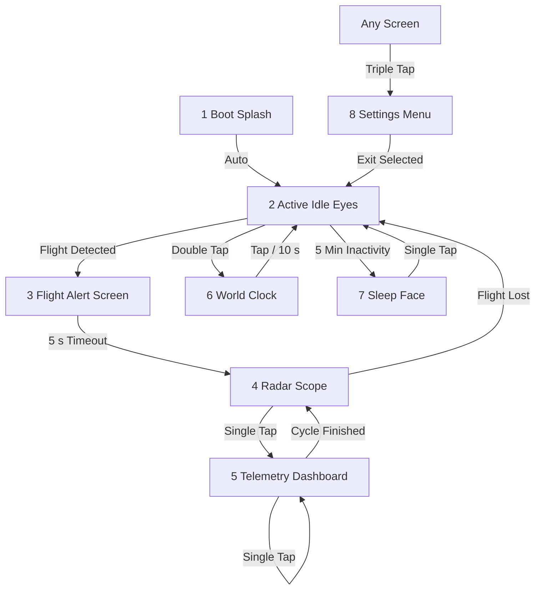

# OLO Aero — Firmware, Settings & Guide

This directory contains the pre-compiled ESP32-C3 Supermini firmware binaries (`bootloader.bin`, `partitions.bin`, `firmware_ssd1306.bin`, and `firmware_sh110x.bin`) and serves as the complete manual for flashing, configuring, and using OLO Aero.

---

## ⚡ Quickstart

### 🚀 Launch the Web Controller

The OLO Aero Web Controller & Flasher is fully hosted and accessible online. Open it in a compatible browser (**Google Chrome** or **Microsoft Edge**):

[👉 Launch OLO Aero Web Controller](https://micromakerlabsfiles-git.github.io/OLO-Aero/)

---

### 1. Flash the Firmware

1. Open the **🔥 Firmware Flasher** tab in the Web Controller.
2. Select your **OLED Display Type** from the dropdown menu (SSD1306 for standard 0.96" screens vs SH110X for standard 1.3" screens).
3. Click **Install**.
4. Plug the ESP32-C3 Supermini in via USB. Select the COM port from the browser dialog and click **Connect**.
   > If the chip is not detected, hold the **BOOT** button on the board while plugging it in to enter bootloader mode.
5. After flashing completes, the **Configure Device** popup appears automatically.
6. (Optional) Enter your **WiFi SSID and Password** to enable live OpenSky flight tracking.
7. Click **Save & Reboot**. The device will write settings to NVS flash and restart.

---

### 2. Connect the Web Controller

1. Switch to the **🎛 Web Controller** tab.
2. Click **Connect Device** at the top right → select the COM port → click **Connect**.
3. Enter the dashboard password:
   ```
   admin
   ```
4. The device confirms with a double-beep. All settings cards become active.

---

### 3. OpenSky JSON Credentials Setup

To track live flights over WiFi, OLO Aero requires an **OpenSky Network API** account with OAuth2 Client Credentials.

1. **Obtain Credentials**: Register an account on the official OpenSky Network site at [opensky-network.org](https://opensky-network.org). Request application API access to get a **Client ID** and a **Client Secret**.
2. **Create the JSON file**: Create a file named `credentials.json` on your computer and paste the following structure with your details:
   ```json
   {
     "clientId": "your-client-id-here",
     "clientSecret": "your-client-secret-here"
   }
   ```
3. **Upload to Device**: In the Web Controller, simply drag-and-drop or browse to upload this `credentials.json` file. It will automatically parse and save the credentials into the device's secure NVS memory!

---

### 4. Running the Radar Demo (Offline Mode)

1. In **WiFi & Display Setup**, set **Flight Tracking Mode** to `Offline Mode`.
2. Navigate to the **📡 Radar Simulator** tab.
3. Enter a callsign (e.g. `AI101`), altitude, speed, and heading.
4. Drag the **red airplane marker** on the map to position it near your home, or click **Start Orbit Sim** to auto-orbit.
5. Click **Send Telemetry**.
6. Watch the OLED:
   - The `! ALERT !` warning screen flashes with the callsign.
   - After 5 seconds, the radar scope appears with a rotating sweep and blinking blip.
   - Single-tap the touch button to cycle through 3 telemetry pages.

---

## 📱 Device Screen States



---

### Screen Details

#### 1. Boot Splash
Animated rocket takeoff with the configurable custom banner text, followed by the boot melody.

#### 2. Active Idle Expressions
Animated expressive eyes — blink, look left, look right, look down. Random idle expressions rotate automatically. Sleep animations are excluded from the awake rotation.

#### 3. Flight Alert Warning Screen
Triggered once per unique callsign when a flight enters the radar radius. Shows the callsign in large text, warning triangles, and strobes the display (normal/inverted) with a cockpit-style alert beep. Does **not** repeat for the same callsign until it leaves range and re-enters.

#### 4. Aspect-Ratio Radar Scope
Plots aircraft as blinking blips on a rectangular, aspect-ratio-correct grid matching the 128×64 OLED. A rotating radar sweep line scans the display. Mathematical line clipping is used at screen borders to prevent display driver freezes.

#### 5. 3-Page Telemetry Dashboard

| Page | Information |
|---|---|
| **Page 1** | Callsign · Altitude (ft / Flight Level) · Ground Speed (kts) · Heading arrow |
| **Page 2** | Country of origin · Vertical Rate (↑ climbing / ↓ descending / — level) · Distance from home (km) |
| **Page 3** | Aircraft Latitude/Longitude · Current network mode |

Pages are navigated manually via single-tap gestures only. Auto-cycling is disabled.

#### 6. World Clock
Dual clock display showing your local city time and one configurable secondary world city. Time is synchronized via WiFi NTP or via Web Controller time sync command.

#### 7. Sleep Face
After 5 minutes of touch inactivity, the display transitions to a sleeping face animation. Single tap wakes it instantly.

#### 8. Settings Menu
Scrollable on-device configuration menu. See full reference below.

---

## 🖐 Touch Gesture Reference

| Gesture | Action |
|---|---|
| **Single Tap** | Wake from Sleep · Idle random expression · Cycle active flight telemetry pages & Radar |
| **Double Tap** | Open World Clock from any state |
| **Triple Tap** | Open Settings Menu from any state |
| **Release (Settings)** | Scroll to next menu item instantly (single beep feedback) |
| **Long Press 1 s (Settings)** | Select / toggle the highlighted menu item |

---

## ⚙️ OLED Settings Menu Reference

Navigate with taps (scroll) and long-press (select):

| Item | Action |
|---|---|
| **Sound: [ON/OFF]** | Toggle all audio beeps globally |
| **LED: [ON/OFF]** | Toggle the WS2812B NeoPixel RGB LED |
| **Neg. Display: [ON/OFF]** | Invert OLED colors (white-on-black vs. black-on-white) |
| **Time Format: [12h/24h]** | Switch clock display format |
| **Network: [ON/OFF]** | `ON` = WiFi Mode (OpenSky live tracking) · `OFF` = Offline Mode |
| **OpenSky Status** | Displays current API sync status. **Long-press to force an immediate OpenSky query** (WiFi mode only) |
| **API Calls Left** | Shows remaining daily OpenSky API credits read from the HTTP response header |
| **Save Settings** | Persist all configuration to NVS flash |
| **Factory Reset** | Erase all NVS data and restart |
| **Exit** | Return to the previous screen |

---

## 🌐 Operating Modes

### WiFi Mode (Network: ON)
- The ESP32 connects to your configured WiFi access point on boot.
- **OpenSky Network API** is queried every ~3 minutes for aircraft within the configured radar radius.
- API credits are tracked from the `X-Rate-Limit-Remaining` HTTP response header.
- Every **500 API calls used**, an on-screen warning is shown and an alert beep plays.
- Time is synced via **NTP** automatically.

### Offline Mode (Network: OFF)
- No WiFi is used. Device boots into idle animations.
- The Web Controller can push simulated radar telemetry via serial.
- Full access to LED, sound, theme, and clock settings.
- Radar simulator works via the **Web Controller drag-and-drop interface**.

---

## ☁️ OpenSky API Status Reference

| Status | Code | Description | Solution |
|---|:---:|---|---|
| **OK** | `200` | Data received and parsed successfully | None needed |
| **IDLE** | `0` | Waiting for first scheduled query after boot | Wait ~3 min or long-press OpenSky Status |
| **LIMIT** | `429` | Daily rate limit reached (anonymous) | Add OAuth2 credentials in Web Controller |
| **ERR 401** | `401` | Invalid credentials | Re-check and re-save Client ID & Client Secret |
| **NO WIFI** | `-1` | Not connected to WiFi | Verify SSID/password and signal strength |
| **ERR 5xx** | `5xx` | OpenSky server error | Wait and retry later |

### API Credit Budget

| Account Type | Daily Limit |
|---|---|
| Anonymous (no credentials) | 400 calls |
| Registered OpenSky account | 4,000 calls |

Credits remaining are read live from the `X-Rate-Limit-Remaining` header on every successful request and shown in the OLED Settings menu under **API Calls Left**.

---

## 🎛 Web Controller Configuration Reference

### 1. OpenSky Network API & Status
- Real-time WiFi connection status and last-sync elapsed time.
- API status indicator with a **Sync & Refresh API Stats** button (triggers `TRIGGER_SYNC` serial command).
- OpenSky OAuth2 fields (Client ID and Client Secret, credentials are stored in device NVS).

### 2. Home Location Settings
- City name search with auto-coordinate lookup.
- Small interactive **Leaflet confirmation map** with draggable home marker.
- **Radar Tracking Radius slider** (10–50 km) — updates the orange radius circle and syncs to device live.
- **Save Location** saves coordinates to NVS instantly, no reboot needed.

### 3. WiFi & Display Setup
- WiFi SSID, Password, OLED display driver type.
- **Flight Tracking Mode**: `Offline Mode` (demo/LED only) or `WiFi Mode` (live OpenSky tracking).
- **Save WiFi & Display** — writes config and reboots device.

### 4. Radar Simulator (Offline/Demo)
- Main Leaflet map with draggable **red aircraft marker** and **orange radar radius circle**.
- Enter callsign, altitude, speed, and heading. Click **Send Telemetry** or **Start Orbit Sim**.
- Drag the home marker to move your home location — auto-syncs to device.

### 5. Layout Theme & RGB Settings
- Custom boot text (max 31 characters).
- Radar layout style: Classic / Tactical / Sci-Fi / HUD.
- LED brightness slider, custom RGB color picker, animation mode.

### 6. Buzzer Volume & Beep Config
- Volume slider (0–100%), global mute toggle.
- Per-event beep style selection: boot melody, config save, flight alert, clock chime.

### 7. Danger Zone
- **Clear Preferences** — erases all NVS config data.
- **Restart Device** — reboots the ESP32.
